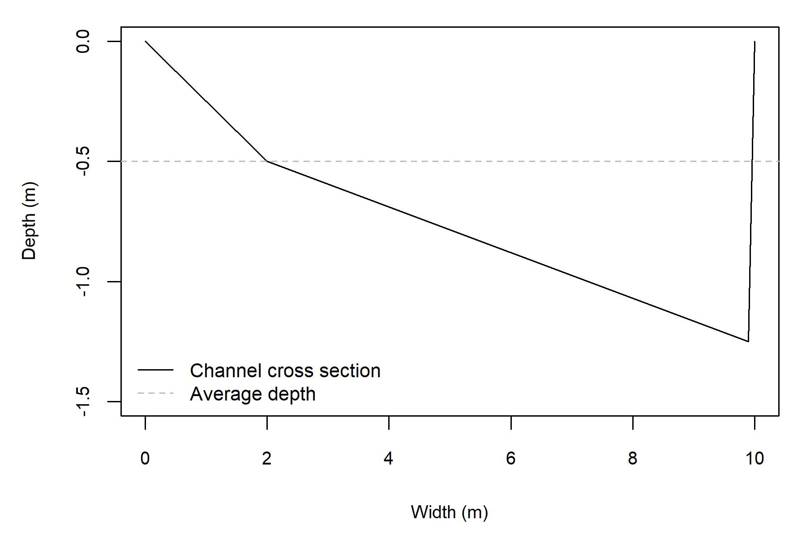

<br>
<br>

# Introduction

This document is a guide for the use of the Geomorphic Approach for conducting instream flow assessments. The Geomorphic Approach has three distinct components: (1) a reach averaged hydraulic simulator, (2) statistical distributions of depths and velocity, and (3) a regime model that can be used to predict how environmental change could affect model boundaries. This approach is designed to be a simple and cost effective approach for conducting instream flow assessments that requires less data inputs and specialized knowledge compared to conventional methods. In addition, the Geomorphic Approach 

This document is primarily focused on the implementation of the hydraulic s. Readers who are interested in the theoretical underpinnings of the this approach are referred to McParland et al. (2016) for information on the hydraulic simulator, Saraeva and Hardy (2009) and Schweizer et al. (2007) for information on the statistical distributions, and Eaton et al. (2004) for information on the regime model. Additionally, Gronsdahl et al. (XXXX) have conducted an evaluation of the Geomorphic Approach. 

This document includes infomration relevant to data collection, data processing, and model implementation.

# Model Overview

The ASHGS is a new method for evaluating the hydraulic component of instream flow assessments that is designed to be implemented using minimal data inputs, reduce fieldwork, and provide considerable cost-savings to implement when compared to conventional approaches. The data inputs that are required to execute ASHGS are relatively minimal and can be collected during one field visit that does not need to coincide with specific flow conditions. The ASHGS method is based around the prediction of reach-averaged channel hydraulics paired with statistical frequency distributions to represent the range of expected hydraulic conditions. A feature of this approach that differentiates it from conventional approaches is that it can be implemented in tandem with the University of British Columbia Regime Model (UBCRM), which is a geomorphic tool that can predict how changes in streamflow regime, land cover, or other environmental variables would impact stream morphology (Eaton et al., 2004). Pairing ASHGS and UBCRIM provides a means to assess ‘what-if’ scenarios regarding how flow diversions, land-use or climate change could affect stream morphology and fish habitat.

The hydraulic geometry input parameters are used to estimate an index of channel shape (b) that ranges from 0 (rectangular channel) to 1 (highly skewed channel) following the approach of Ferguson (2003). Then, ASHGS predicts a cumulative depth distribution, which represents an idealized reach cross-section at bankfull conditions. To simulate below bankfull conditions, the model iteratively drops the water level to evaluate how the depths change. For each water level, mean velocity is estimated using the variable power-law flow resistance equation presented by Ferguson (2007), which has been shown to more accurately represent the hydraulics of small-medium sized gravel rivers than other common flow resistance equations, including Manning’s equation. For each modelled water level, statistical frequency distributions are paired with the reach-averaged outputs to generate an estimate of the reach-averaged depth and velocity distributions. These hydraulic outputs are then coupled with a statistical frequency distribution to estimate an expected range of depths and velocities at each simulated water level. These outputs can then be paired with habitat suitability curves to generate a habitat-streamflow relationship.

# Install Package

The below code snippet uses the 'devtools' package to install the package from Github, where it is hosted. Code should be un-commented out where necessary to install the package for the first time. 

```{r, echo = T, message = F}

## install and load devtools
# install.packages(devtools)
# library(devtools)

## install and load package
# install_github("SGronsdahl/GeomorphicInstreamFlowTool")
library(GeomorphicInstreamFlowTool)

```


# Execute the Hydraulic Simulation Routine

The first function in the GeomorphicInstreamFlowTool package executes the hydraulic simulator and produces a data frame of outputs. The below code snippet provides an example of how to run the model

## Data Requirements

The input parameters for the AvgHydraulics function are as follows:


* **Channel gradient**, in m/m (S). This field is mandatory.
* **Bankfull width**, in m (Wb). This field is mandatory.
* **mean bankfull depth**, in m (db). This field is mandatory.
* **the maximum bankfull** depth, in m (dmax). This field is optional.
* **84th percentile of bed grain size**, in mm (i.e. the grain size of which 84% of the bed is finer, D84). 

The channel dimensions are used to generate an index of channel shape, *b*. If only db is provided, then *b* is calculated as follows: $b = 1- (Wb / db)$. If dmax is provided, then *b* is calculated as follows: $b = 1 - (db/dmax)$. Alternatively, the R function allows the user to specify *b*, directly over-riding these functions. This option is primarily available for Monte-Carlo or bootstrapping-type analyses to quantify uncertainty. 

## Code Snippets

The following code snippets showcase the execution of the AvgHydraulics function.


```{r, echo = T, message = F}

hydraulics = AvgHydraulics(S = 0.01, wb = 10, db = 0.5, 
                           max_Q = 0.1, D84 = 100)
head(hydraulics)

```

Here the dmax term is specificied within the AvgHydraulics function call. The same outputs are included for comparison purposes.

```{r, echo = T}

hydraulics = AvgHydraulics(S = 0.01, wb = 10, db = 0.5, db_max = 1.25,
                           max_Q = 0.1, D84 = 100)
head(hydraulics)

```

This function also outputs two files to the working directory: a figure of the cross-section of the idealized reach and a .csv file of the simluated reach-averaged hydraulics. This feature may be turned off by specifying the following argument to the function: xs_ouput = FALSE. The figure that represents the reach cross-section should appear as follows: 


# Execute the Habitat Function

To use this functionality to make estimates of how fish habitat changes as a function of streamflow, the Habitat function must be used. This function attaches statistical frequency distribution to the mean depths and velocities that are output by the hydraulic simulator function. Thhis function attaches the exponential-normal frequency distribution described by Schweizer et al. (2007) to velocities an the normal-log-normal frequency distribution described by Saraeva and Hardy (2009) to depths. These disitributions are then paired with user-specified habitat suitability curves to generate reach-averaged depth and velocity suitabilities. To estimate the WUA of the stream reach, these suitabilities are multiplied with the modelled stream width to develop a WUA value in m^2^ / m.

## Data Requirements

The input parameters for the Habitat function are as follows:


* **hydrualics**, a data frame of outputs generated by the AvgHydraulics fuonction. This field is mandatory.
* **d_curve**, depth suitability curve.  This is a dataframe with two columns: 'depth' (m) and 'suit' (dimensionless suitability from 0-1). This field is mandatory.
* **v_curve**, velocity suitability curve.  This is a dataframe with two columns: 'velocity' (m/s) and 'suit' (dimensionless suitability from 0-1). This field is mandatory.
* **s_curve**, substrate suitability curve.  This is a dataframe of substrate suitabilities with three columns: 'lower' (mm) and 'upper' (mm) of grain size classes and 'suit' (dimensionless suitability from 0-1). This field is optional.
* **gsd**, vector of grain size distribution (mm). This field is optional

If both the s_curve and gsd fields are specified, then a reach-averaged substrate suitability will be calculated. If neither, or only one of these inputs are specified, then the reach-average substrate suitability defaults to a value of 1.0.


```{r, echo = T}

head(hydraulics)

```


# References

This function executes a model designed and presented in the following reference:

McParland D, Eaton B, Rosenfeld J. 2016. At-a-station hydraulic geometry simulator. River Research and Applications 32 (3): 399-410

# Aknowledgements

Help developing this script was provided by Jordyn Carss, Dan Moore, Brett Eaton, and Jordan Rosenfeld.  Habitat suitability were developed by Ron Ptolemy.

***
